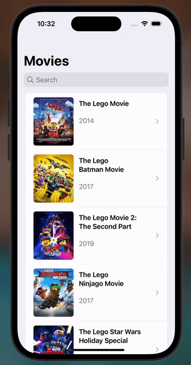
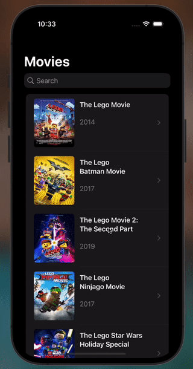

# Swift Movies App

## Description

Native iOS app using the Model - View - ViewModel (MVVM) architecture pattern.

The app shows a list of movies and their details. The data is fetched from the [The Movie Database API](https://developers.themoviedb.org/3/getting-started/introduction).

Supports Light and Dark mode.

Handle loading, success and error states.

Reusable components.

Use of extensions to create reusable code.

Custom component for displaying remote images.

## Screenshots

